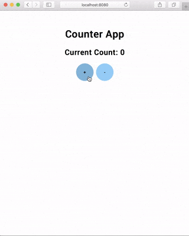

[Up](./index.md)

# AngularDart Counter Tutorial

원문: [Bloc / Tutorial / AngularDart / Counter](https://felangel.github.io/bloc/#/angularcountertutorial)


> 다음 튜토리얼에서는 Bloc 라이브러리를 사용하여 AngularDart에 카운터를 빌드 할 것입니다.



<p id = "setup"/>

## 준비 (Setup)

우리는 [stagehand](https://github.com/dart-lang/stagehand)로 새로운 AngularDart 프로젝트를 만들어 시작합니다.

```bash
stagehand web-angular
```

`pub global activate stagehand`를 실행하여 stagehand를 활성화 하세요.

그러면 우리는 `pubspec.yaml`의 내용을 다음과 같이 대체 할 수 있습니다:

```yaml
name: angular_counter
description: A web app that uses AngularDart Components

environment:
  sdk: ">=2.0.0 <3.0.0"

dependencies:
  angular: ^5.0.0
  angular_components: ^0.9.0
  angular_bloc: ^0.8.0

dev_dependencies:
  angular_test: ^2.0.0
  build_runner: ^0.10.0
  build_test: ^0.10.2
  build_web_compilers: ^0.4.0
  test: ^1.0.0
```

모든 의존성을 설치합니다.

```bash
pub get
```

카운터 앱은 카운터 값을 증가 및 감소시키는 두 개의 버튼과 현재 값을 표시하는 요소를 갖습니다. `CounterEvent`를 디자인 하겠습니다.

<p id = "counterevent"/>

## CounterEvent

```dart
enum CounterEvent { increment, decrement }
```

## CounterState

카운터의 상태는 정수로 나타낼 수 있으므로 사용자 정의 클래스를 만들 필요가 없습니다!

<p id = "counterbloc"/>

## CounterBloc

```dart
class CounterBloc extends Bloc<CounterEvent, int> {
  @override
  int get initialState => 0;

  @override
  Stream<int> mapEventToState(CounterEvent event) async* {
    switch (event) {
      case CounterEvent.decrement:
        yield currentState - 1;
        break;
      case CounterEvent.increment:
        yield currentState + 1;
        break;
    }
  }
}
```

**Note**: 클래스 선언에서 `CounterBloc`은 `CounterEvents`를 입력으로 사용하고 정수를 출력한다고 말할 수 있습니다.

<p id = "counterapp"/>

## CounterApp

이제 `CounterBloc`을 완전히 구현 했으므로 `AngularDart` `App` `Component`를 만들 수 있습니다.

우리의 `app.component.dart`는 다음과 같습니다 :

```dart
import 'package:angular/angular.dart';

import 'package:angular_counter/src/counter_page/counter_page_component.dart';

@Component(
  selector: 'my-app',
  templateUrl: 'app_component.html',
  directives: [CounterPageComponent],
)
class AppComponent {}
```

우리의 `app.component.html`은 다음과 같이 보일 것입니다 :

```html
<counter-page></counter-page>
```

<p id = "counterpage"/>

## CounterPage

마지막으로 카운터 페이지 구성 요소를 만드는 것뿐입니다.

우리의 `counter_page_component.dart`는 다음과 같습니다:

```dart
import 'package:angular/angular.dart';
import 'package:angular_components/angular_components.dart';

import 'package:angular_bloc/angular_bloc.dart';

import './counter_bloc.dart';

@Component(
  selector: 'counter-page',
  templateUrl: 'counter_page_component.html',
  styleUrls: ['counter_page_component.css'],
  directives: [MaterialFabComponent],
  providers: [ClassProvider(CounterBloc)],
  pipes: [BlocPipe],
)
class CounterPageComponent implements OnDestroy {
  final CounterBloc counterBloc;

  CounterPageComponent(this.counterBloc) {}

  @override
  void ngOnDestroy() {
    counterBloc.dispose();
  }

  void increment() {
    counterBloc.dispatch(CounterEvent.increment);
  }

  void decrement() {
    counterBloc.dispatch(CounterEvent.decrement);
  }
}
```

**Note**: 우리는 `AngularDart`의 의존성 주입 시스템을 사용하여 `CounterBloc` 인스턴스에 접근 할 수 있습니다. 우리는 이것을 `Provider`로 등록했기 때문에 `AngularDart`는 `CounterBloc`을 적절하게 해결할 수 있습니다.

**Note**: 우리는`CounterBloc`을 `ngOnDestroy`에 버립니다.

**Note**: `BlocPipe`를 import 하여 템플릿에 사용할 수 있습니다.

마지막으로, 우리의 `counter_page_component.html`는 다음과 같아야 합니다 :

```html
<div class="counter-page-container">
  <h1>Counter App</h1>
  <h2>Current Count: {{ counterBloc | bloc }}</h2>
  <material-fab class="counter-fab-button" (trigger)="increment()"
    >+</material-fab
  >
  <material-fab class="counter-fab-button" (trigger)="decrement()"
    >-</material-fab
  >
</div>
```

**Note**: 우리는 `counterBloc` 상태를 업데이트 할 때 표시 할 수 있도록 `BlocPipe`를 사용하고 있습니다.

그게 전부 입니다! 우리는 프리젠테이션 레이어를 비즈니스 로직 레이어와 분리했습니다. 우리의`CounterPageComponent`는 사용자가 버튼을 누를 때 어떤 일이 일어나는지 전혀 알지 못합니다; `CounterBloc`에 알리기 위한 이벤트를 전달합니다. 또한, 우리의 `CounterBloc`은 상태 (카운터 값)에 어떤 일이 일어나고 있는지 전혀 알지 못합니다. 단순히 `CounterEvent`를 정수로 변환하는 것입니다.

우리는``webdev serve`로 앱을 구동 할 수 있고 그것을 [localhost:8080](http : // localhost : 8080)으로 볼 수 있습니다.

이 예제의 전체 소스는 [여기](https://github.com/felangel/Bloc/tree/master/examples/angular_counter)에서 찾을 수 있습니다.

---

이전:

다음:
