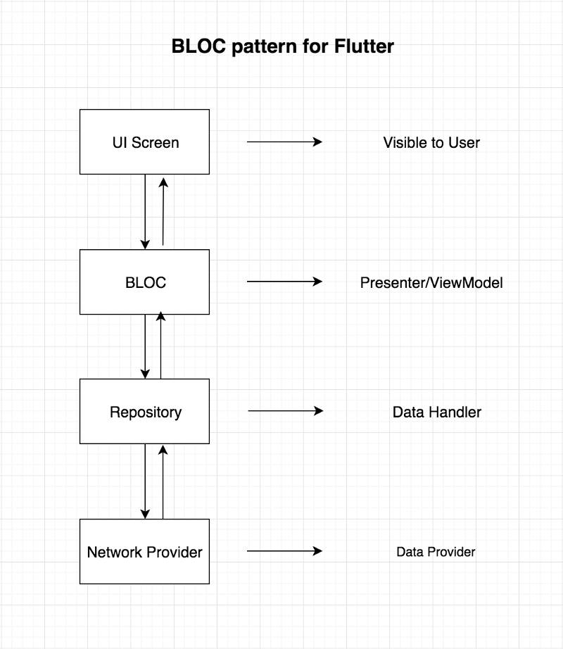
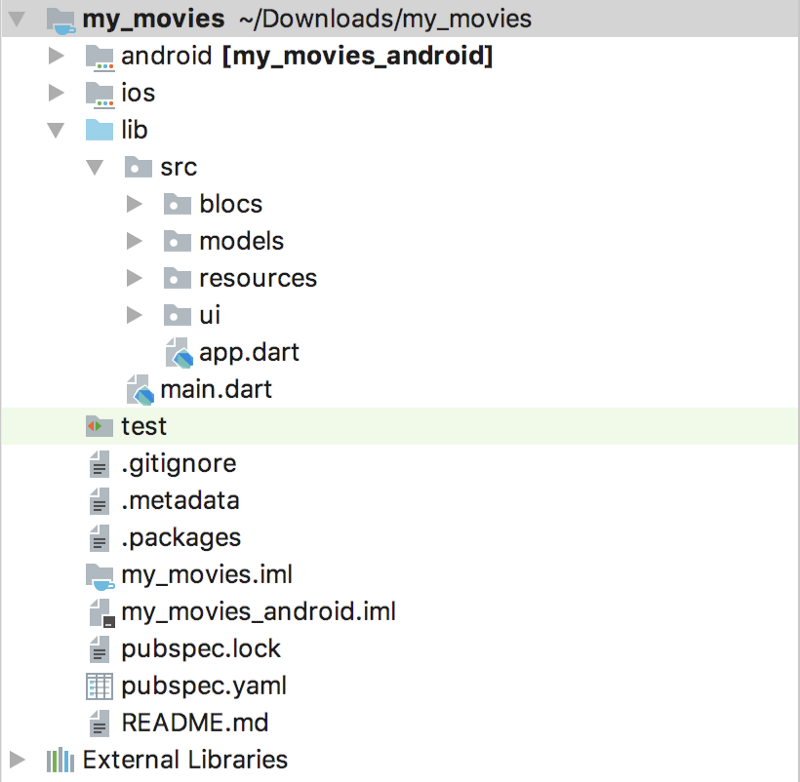

# BLOC 패턴을 사용한 Flutter 프로젝트 아키텍쳐 설계

원문: [Architect your Flutter project using BLOC pattern](https://medium.com/flutterpub/architecting-your-flutter-project-bd04e144a8f1)

여러분 안녕하세요! 저는 Flutter에 관한 새로운 글을 가지고 왔습니다. 이번에는 "Flutter 프로젝트를 아키텍쳐 설계하는 방법" 에 대해 이야기하고, 실습을 해 보겠습니다. 그러면, Flutter 프로젝트를 손쉽게 유지, 확장 및 테스트 할 수 있습니다. 실제 주제로 들어가기 전에, 저는 왜 우리가 프로젝트의 견고한 아키텍쳐를 세수립하는데 집중해야 하는지에 대한 작은 이야기를 나누고 싶습니다.

### 왜 프로젝트에 아키텍쳐를 도입해야 할까요? (Why you need to architect your project?)

"저는 옛날 옛적 2015년에 초보 경쟁적인 프로그래머 ([Hackerearth](http://www.hackerearth.com/@sagarsuri56) 프로필; novice competitive programmer)였고 안드로이드 앱 개발을 배우기도 했습니다. 경쟁적인 프로그래머(competitive programmer)로서 저는 제가 작성한 프로그램의 출력과 효율성에 대해서만 신경을 쏟았습니다. 제가 작성한 프로그램이나 프로젝트를 구조화하는 데 있어 두 번째 생각을 한 적이 결코 없습니다. 이 트렌드와 스타일은 안드로이드 프로젝트에도 반영되었습니다. 저는 경쟁적인 프로그래머의 사고 방식으로 안드로이드 애플리케이션을 작성 했습니다. 처음에는 자신의 프로젝트를 진행할 때 새로운 기능을 추가하거나 기존 기능을 변경하는 데 필요한 보스나 관리자가 없어서 좋았습니다. 하지만 스타트업 컴퍼니에서 Android 앱을 개발하기 시작했습니다. 저는 항상 앱에서 기존 기능을 변경하는 데 많은 시간이 걸렸습니다. 뿐만 아니라, 앱을 빌드하는 과정에서 추가 기능으로 버그를 추가하기도 했습니다. 이 모든 문제의 주된 근본 원인은 **"저는 결코 어떤 아키텍쳐 패턴도 따르지 않았거나 제 프로젝트를 구조화하지 않았습니다"**였습니다. 시간이 지나면서 소프트웨어 세계를 이해하기 시작하면서, 저는 경쟁적인 프로그래머에서 소프트웨어 엔지니어로 전향했습니다. 오늘 새 프로젝트를 시작할 때마다 프로젝트의 견고한 구조 또는 아키텍처를 만드는 것이 가장 중요합니다. 그 덕분에 더 나은 스트레스 없는 소프트웨어 엔지니어가 되었습니다. 😄"

지루한 이야기는 이제 내려 놓겠습니다. 이 글의 주요 목표에 대해 시작하겠습니다. "BLOC 패턴을 사용하여 Flutter 프로젝트를 설계하십시오."

### 우리의 목표 (Our Goal)

저는 아주 간단한 앱을 만들 것입니다. 그리드 목록을 볼 수 있는 화면이 하나 있습니다. 이러한 항목은 서버에서 가져옵니다. 항목 목록은 [**The Movies DB**](https://www.themoviedb.org/) 사이트에서 인기 있는 영화가 될 것입니다.

**Note**: 진행하기 전에 [Widgets](https://docs.flutter.io/flutter/widgets/Widget-class.html), [Flutter에서 네트워크 호출하는 방법]( https://medium.com/flutterpub/making-a-network-call-in-flutter-f712f2137109) 그리고 다트에 대한 중간 지식이 있습니다. 이 기사가 조금 길어지고 다른 리소스에 많이 연결되므로 특정 주제를 더 자세히 읽을 수 있습니다.

그럼 쇼를 시작하겠습니다. 😍

코드로 직접 들어가기 전에. 이 응용 프로그램을 구조화하기 위해, 우리가 따르게 될 아키텍처에 대한 시각적 경험을 제공하겠습니다.



BLOCK 패턴

위의 다이어그램은 데이터가 UI에서 데이터 레이어로 또는 그 반대로 이동하는 방식을 보여줍니다. BLOC는 UI 화면에서 위젯에 대한 참조를 절대 가지지 않습니다. UI 화면은 BLOC 클래스에서 오는 변경 사항만 관찰합니다. 이 다이어그램을 이해하기 위해 간단한 Q&A를 해봅시다.

#### 1. BLOC 패턴은 무엇입니까? (What is BLOC Pattern?)

Google 개발자가 권장하는 Flutter의 상태 관리 시스템입니다. 프로젝트를 관리하는 데 도움이되며 프로젝트의 중앙 위치에서 데이터에 액세스 할 수 있습니다.

#### 2. 이 아키텍처를 다른 아키텍처와 연관시킬 수 있습니까?

예, 물론입니다. MVP와 MVVM이 좋은 예입니다. 변경되는 것만 BLOC가 MVVM의 ViewModel로 대체됩니다.

#### 3. BLOC에 속한 것은 무엇입니까? 또는 한 곳에서 상태를 관리하는 핵심은 무엇입니까?

STREAMS 또는 REACTIVE 접근법. 일반적으로 데이터는 BLOC에서 UI로 또는 UI에서 BLOC로 스트림 형태로 흐르게 됩니다. 스트림에 대해 들어 본 적이 없다면 이 [Stack Overflow](https://stackoverflow.com/a/1216397/8327394) 답을 읽어보세요.

이 작은 Q&A 섹션이 당신의 궁금함을 풀어 주었기를 희망합니다. 명확한 설명이 필요하거나 특정 질문을 하고 싶으면 [LinkedIn](https://www.linkedin.com/in/sagar-suri/)에서 아래에 의견을 남기거나 나와 직접 연락하시면 됩니다.

**BLOC 패턴으로 프로젝트를 시작하겠습니다. **

먼저 새 프로젝트를 만듭니다. 터미널에 아래 명령을 입력하세요.

```sh
flutter create myProjectName
```

 `main.dart` 파일의 모든 코드를 지우고, 아래 코드를 넣어 주세요.

```dart
import 'package:flutter/material.dart';
import 'src/app.dart';

void main(){
  runApp(App());
}
```

두 번째 줄에서 오류가 발생할 것입니다. 우리는 다음 단계에서 그 오류를 해결할 것입니다.

`lib` 패키지 아래에 `src` 패키지를 만듭니다. src 패키지 안에 `app.dart`라는 이름의 파일을 만들고 아래 코드를 복사하여 붙여 넣으세요.

```dart
import 'package:flutter/material.dart';
import 'ui/movie_list.dart';

class App extends StatelessWidget {
  @override
  Widget build(BuildContext context) {
    // TODO: implement build
    return MaterialApp(
        theme: ThemeData.dark(),
        home: Scaffold(
          body: MovieList(),
        ),
      );
  }
}
```

src 패키지 내에  `resources`라는 이름으로 새 패키지를 만드세요.

이제 아래 그림과 같이 `blocs`, `models` , `resources` 및 `ui`라는 새로운 패키지를 만든 다음 프로젝트의 골격을 설정합니다.



프로젝트 구조

`blocs` 패키지는 BLOC 구현에 관련된 파일을 가집니다. `models` 패키지는 POJO 클래스 또는 우리가 서버에서 얻을 JSON 응답의 모델 클래스를 포함합니다. `resources` 패키지는 `Repository` 클래스와 네트워크 호출 구현 클래스를 가집니다. `ui` 패키지는 사용자가 볼 수 있는 화면을 가집니다.

마지막으로 [RxDart](https://pub.dartlang.org/packages/rxdart) 서트파트 라이브러리를 추가해야합니다. `pubspec.yaml` 파일을 열고, 아래 그림과 같이 `rxdart: ^0.18.0`을 추가해 주세요.

```yaml
dependencies:
  flutter:
    sdk: flutter

  # The following adds the Cupertino Icons font to your application.
  # Use with the CupertinoIcons class for iOS style icons.
  cupertino_icons: ^0.1.2
  rxdart: ^0.18.0
  http: ^0.12.0+1
```

프로젝트를 동기화하거나 아래 명령을 터미널에 입력 하세요. 프로젝트 디렉토리에서 이 명령을 실행 하세요.

```sh
flutter packages get
```

이제 우리는 프로젝트의 골격을 완성했습니다. 프로젝트의 최하위 계층, 즉 **네트워크 계층**을 처리 할 차례입니다. 우리가 사용할 할 API 엔드 포인트를 이해해야 합니다. 이 [링크](https://www.themoviedb.org/account/signup)를 클릭하면 영화 데이터베이스 API 사이트로 이동합니다. 등록하고 설정 페이지에서 API 키를 받으세요. 우리는 응답을 얻기 위해 아래 URL을 치는 것입니다:

`http://api.themoviedb.org/3/movie/popular?api_key=<your API key>`

위의 링크에 API 키를 입력하고 큰 따옴표도 제거하십시오. 다음과 같은 JSON 응답을 받을 수 있습니다.

```json
{
  "page": 1,
  "total_results": 19772,
  "total_pages": 989,
  "results": [
    {
      "vote_count": 6503,
      "id": 299536,
      "video": false,
      "vote_average": 8.3,
      "title": "Avengers: Infinity War",
      "popularity": 350.154,
      "poster_path": "\/7WsyChQLEftFiDOVTGkv3hFpyyt.jpg",
      "original_language": "en",
      "original_title": "Avengers: Infinity War",
      "genre_ids": [
        12,
        878,
        14,
        28
      ],
      "backdrop_path": "\/bOGkgRGdhrBYJSLpXaxhXVstddV.jpg",
      "adult": false,
      "overview": "As the Avengers and their allies have continued to protect the world from threats too large for any one hero to handle, a new danger has emerged from the cosmic shadows: Thanos. A despot of intergalactic infamy, his goal is to collect all six Infinity Stones, artifacts of unimaginable power, and use them to inflict his twisted will on all of reality. Everything the Avengers have fought for has led up to this moment - the fate of Earth and existence itself has never been more uncertain.",
      "release_date": "2018-04-25"
    },
```

이 타입의 응답을 위한 모델 또는 POJO 클래스를 작성해 보겠습니다. `models` 패키지 내에 `item_model.dart` 라는 이름으로 새 파일 만드세요. 아래 코드를 복사하여 `item_model.dart` 파일에 붙여 넣으세요.

```dart
class ItemModel {
  int _page;
  int _total_results;
  int _total_pages;
  List<_Result> _results = [];

  ItemModel.fromJson(Map<String, dynamic> parsedJson) {
    print(parsedJson['results'].length);
    _page = parsedJson['page'];
    _total_results = parsedJson['total_results'];
    _total_pages = parsedJson['total_pages'];
    List<_Result> temp = [];
    for (int i = 0; i < parsedJson['results'].length; i++) {
      _Result result = _Result(parsedJson['results'][i]);
      temp.add(result);
    }
    _results = temp;
  }

  List<_Result> get results => _results;

  int get total_pages => _total_pages;

  int get total_results => _total_results;

  int get page => _page;
}

class _Result {
  int _vote_count;
  int _id;
  bool _video;
  var _vote_average;
  String _title;
  double _popularity;
  String _poster_path;
  String _original_language;
  String _original_title;
  List<int> _genre_ids = [];
  String _backdrop_path;
  bool _adult;
  String _overview;
  String _release_date;

  _Result(result) {
    _vote_count = result['vote_count'];
    _id = result['id'];
    _video = result['video'];
    _vote_average = result['vote_average'];
    _title = result['title'];
    _popularity = result['popularity'];
    _poster_path = result['poster_path'];
    _original_language = result['original_language'];
    _original_title = result['original_title'];
    for (int i = 0; i < result['genre_ids'].length; i++) {
      _genre_ids.add(result['genre_ids'][i]);
    }
    _backdrop_path = result['backdrop_path'];
    _adult = result['adult'];
    _overview = result['overview'];
    _release_date = result['release_date'];
  }

  String get release_date => _release_date;

  String get overview => _overview;

  bool get adult => _adult;

  String get backdrop_path => _backdrop_path;

  List<int> get genre_ids => _genre_ids;

  String get original_title => _original_title;

  String get original_language => _original_language;

  String get poster_path => _poster_path;

  double get popularity => _popularity;

  String get title => _title;

  double get vote_average => _vote_average;

  bool get video => _video;

  int get id => _id;

  int get vote_count => _vote_count;
}
```

이 파일을 JSON 응답에 map 할 수 있기를 바랍니다. 그렇지 않은 경우, 우리는`Results` 클래스 내의 `poster_path`에 관심이 있을 것입니다. `poster_path`는 앞으로 진행할 때 알아야 할 사항입니다. 인기있는 영화의 모든 포스터를 기본 UI에 표시합니다. `fromJson()`메소드는 단지 파싱된 JSON을 가져 와서 올바른 변수에 값을 넣습니다. (에....?)

이제 네트워크 구현을 할 차례입니다. `resources` 패키지 안에 `movie_api_provider.dart`이름으로 새 파일을 만들고 아래 코드를 복사하여 붙여 넣으세요.

```dart
import 'dart:async';
import 'package:http/http.dart' show Client;
import 'dart:convert';
import '../models/item_model.dart';

class MovieApiProvider {
  Client client = Client();
  final _apiKey = 'your_api_key';

  Future<ItemModel> fetchMovieList() async {
    print("entered");
    final response = await client
        .get("http://api.themoviedb.org/3/movie/popular?api_key=$_apiKey");
    print(response.body.toString());
    if (response.statusCode == 200) {
      // If the call to the server was successful, parse the JSON
      return ItemModel.fromJson(json.decode(response.body));
    } else {
      // If that call was not successful, throw an error.
      throw Exception('Failed to load post');
    }
  }
}
```

**Note** : `movie_api_provider.dart` 파일의 변수 `_apiKey`에 API키를 넣으세요. 이것을 빠뜨리면 작동하지 않습니다.

`fetchMovieList()` 메소드는 API에 대한 네트워크 호출을 담당합니다. 네트워크 호출이 완료되면 네트워크 호출이 성공했거나 성공할 경우 [`Future`](https://api.dartlang.org/stable/2.0.0/dart-async/Future-class.html) `ItemModel` 객체를 반환합니다. 실패하면 Exception를 던집니다.

다음으로 `resources` 패키지 안에 `repository.dart`라는 이름의 새 파일을 만들고 아래 코드를 복사하여 파일 안에 붙여 넣으세요.

```dart
import 'dart:async';
import 'movie_api_provider.dart';
import '../models/item_model.dart';

class Repository {
  final moviesApiProvider = MovieApiProvider();

  Future<ItemModel> fetchAllMovies() => moviesApiProvider.fetchMovieList();
}
```

우리는 `movie_api_provider.dar` 파일을 `import` 해서 그것의 `fetchMovieList()`메소드를 호출하고 있습니다. 이 `Repository` 클래스는 데이터가 BLOC로 전달되는 중심점입니다.

이제는 블록 로직 구현을 하는 조금 복잡한 부분이 있습니다. `blocs` 패키지 안에 새로운 파일을 만들고 `movies_bloc.dart`라고 이름을 짓습니다. 코드 아래에 붙여 넣기를 복사하면 코드를 자세히 설명하지 않겠습니다.

```dart
import '../resources/repository.dart';
import 'package:rxdart/rxdart.dart';
import '../models/item_model.dart';

class MoviesBloc {
  final _repository = Repository();
  final _moviesFetcher = PublishSubject<ItemModel>();

  Observable<ItemModel> get allMovies => _moviesFetcher.stream;

  fetchAllMovies() async {
    ItemModel itemModel = await _repository.fetchAllMovies();
    _moviesFetcher.sink.add(itemModel);
  }

  dispose() {
    _moviesFetcher.close();
  }
}

final bloc = MoviesBloc();
```

우리는  `import 'package:rxdart/rxdart.dart';`를 임포트 하고 있으며 이것은 이 파일 안에 모든 [RxDart](https://pub.dartlang.org/packages/rxdart) 관련 메소드와 클래스를 임포트 합니다. `MoviesBloc` 클래스 안에서 우리는 `fetchAllMovies()`에 접근하는 데 사용될 `Repository` 클래스 객체를 생성 합니다. 우리는 `ItemModel`의 형태로 서버에서 가져온 데이터를 추가하는 책임이 있는 [`PublishSubject`](https://pub.dartlang.org/documentation/rxdart/latest/rx/PublishSubject-class.html) 객체를 생성하고, UI 화면에 스트림으로 전달합니다. `ItemModel` 객체를 스트림으로 전달하기 위해 반환 타입이 [`Observable`](https://youtu.be/XbOuCBuQepI) 인 `allMovies()`메서드를 만들었습니다 (`Observables`를 이해하지 못한다면 이 비디오를 보세요). 마지막 행을 보면 `bloc` 객체가 생성됩니다. 이렇게 하면 우리는 `MoviesBloc` 클래스의 단일 인스턴스에 대한 액세스를 UI 화면에 제공합니다.

반응형 프로그래밍이 무엇인지 모르는 경우 이 간단한 [설명](https://dzone.com/articles/only-introduction-reactive)을 읽어 보세요. 간단히 말하면, 서버에서 오는 새로운 데이터가 있을 때마다 간단히 반응하면 됩니다. 이 업데이트 작업을 단순화 하기 위해 우리는 `MoviesBloc` 클래스에서 발생하는 모든 변경 사항을 계속 관찰하고, 이에 따라 콘텐츠를 업데이트 하도록 UI 화면에 지시합니다. 새로운 데이터를 "관찰"하는 것은 `RxDart`를 사용하여 수행 할 수 있습니다.

이제 마지막 섹션. `ui` 패키지 내에 `movie_list.dart`라는 새 파일을 만들고, 아래 코드를 복사하여 붙여 넣으세요.:

```dart
import 'package:flutter/material.dart';
import '../models/item_model.dart';
import '../blocs/movies_bloc.dart';

class MovieList extends StatelessWidget {
  @override
  Widget build(BuildContext context) {
    bloc.fetchAllMovies();
    return Scaffold(
      appBar: AppBar(
        title: Text('Popular Movies'),
      ),
      body: StreamBuilder(
        stream: bloc.allMovies,
        builder: (context, AsyncSnapshot<ItemModel> snapshot) {
          if (snapshot.hasData) {
            return buildList(snapshot);
          } else if (snapshot.hasError) {
            return Text(snapshot.error.toString());
          }
          return Center(child: CircularProgressIndicator());
        },
      ),
    );
  }

  Widget buildList(AsyncSnapshot<ItemModel> snapshot) {
    return GridView.builder(
        itemCount: snapshot.data.results.length,
        gridDelegate:
            new SliverGridDelegateWithFixedCrossAxisCount(crossAxisCount: 2),
        itemBuilder: (BuildContext context, int index) {
          return Image.network(
            'https://image.tmdb.org/t/p/w185${snapshot.data
                .results[index].poster_path}',
            fit: BoxFit.cover,
          );
        });
  }
}
```

이 클래스의 가장 흥미로운 부분은 `StatefulWidget`을 사용하지 않는 것입니다. 대신 StatefulWidget이 UI를 업데이트하는 것과 동일한 작업을 수행하는 `StreamBuilder`를 사용하고 있습니다.

여기서 한가지 지적해야 할 것은 `build(context)`메소드가 여러 번 호출 될 수 있기 때문에 빌드 메소드 내에서 네트워크 호출을 하고 있다는 것입니다. 나는 이 글을 더 나은 접근 방식으로 업데이트 할 것입니다. 하지만 지금은 글이 커지고 복잡해지면서 상황을 간단하게 유지하고 있습니다. 즉, `build(context)`메소드 안에서 네트워크 호출을 하는 것입니다.

앞에서 언급했듯이, 우리의 `MoviesBloc` 클래스는 새로운 데이터를 스트림으로 전달합니다. 따라서 스트림을 처리하기 위해 내장 클래스 즉, 들어오는 스트림을 수신하여, 이에 따라 UI를 업데이트하는 `StreamBuilder`가 있습니다. `StreamBuilder`는 `MovieBloc`의 `allMovies()` 메소드가 `stream`을 반환 할 때 전달하는 `stream` 매개 변수를 기대합니다. 따라서 `StreamBuilder`는 최신 데이터로 위젯을 다시 렌더링 합니다. 여기서 스냅샷 데이터가 `ItemModel` 객체를 가지고 있습니다. 이제 개체에 있는 모든 것을 표시 할 수 있는 위젯을 만들 수 있습니다 (여기에서 당신의 창의성이 그림에 나타납니다). `GridView`를 사용하여 `ItemModel` 객체의 결과 목록에 있는 모든 포스터를 표시했습니다. 이것은 최종 제품의 출력입니다.

<iframe width="560" height="315" src="https://www.youtube.com/embed/f4ztwmHrBWI" frameborder="0" allow="accelerometer; autoplay; encrypted-media; gyroscope; picture-in-picture" allowfullscreen></iframe>

작은 데모. 비디오가 전체 프레임을 캡처하지 못했습니다. 😐

그래서 우리는 이 글의 끝에 도달 했습니다. 끝까지 따라와준 여러분은 훌륭하십니다!  이 글이 맘에 들었기를 바랍니다. 의심(?)이나 질문이 있으시면 [LinkedIn](https://www.linkedin.com/in/sagar-suri) 또는 [Twitter](https ://twitter.com/SagarSuri94). 몇 가지 박수와 의견이있는 기사에 감사드립니다.

완전한 코드가 필요한 경우. 다음은 프로젝트의 [github 저장소](https://github.com/SAGARSURI/MyMovies)입니다.

------

The [**Flutter Pub**](https://medium.com/flutterpub)  is a medium publication to bring you the latest and amazing resources  such as articles, videos, codes, podcasts etc. about this great  technology to teach you how to build beautiful apps with it. You can  find us on [Facebook](https://www.facebook.com/FlutterPub), [Twitter](https://twitter.com/FlutterPub), and [Medium](https://medium.com/flutterpub) or learn more about us [here](https://medium.com/flutterpub/welcome-to-flutter-pub-8480678ed212). We’d love to connect! And if you are a writer interested in writing for us, then you can do so [through these guidelines](https://medium.com/flutterpub/how-to-submit-your-article-s-on-flutterpub-7b6bf37dfc43).