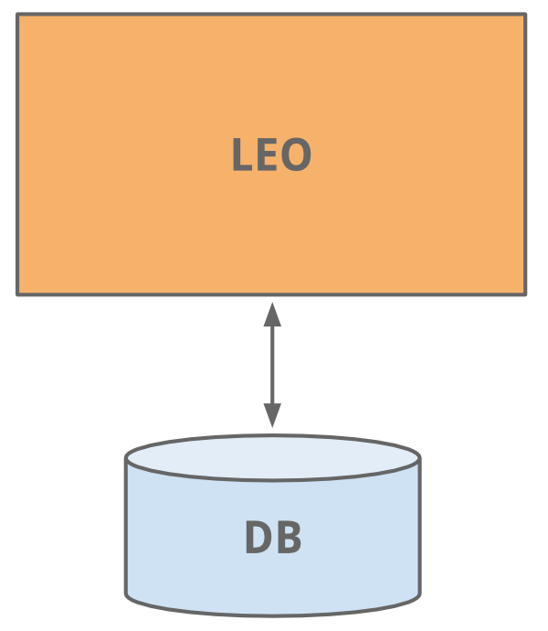
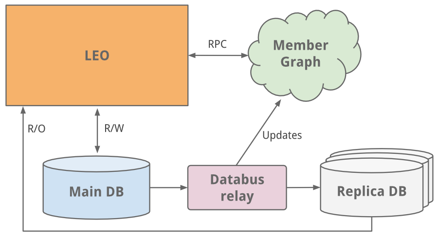
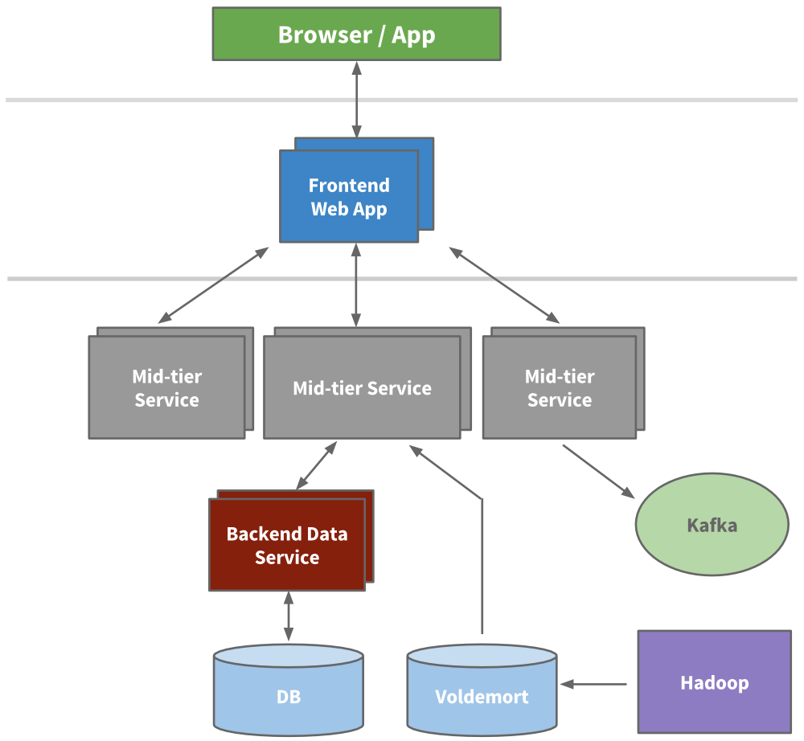
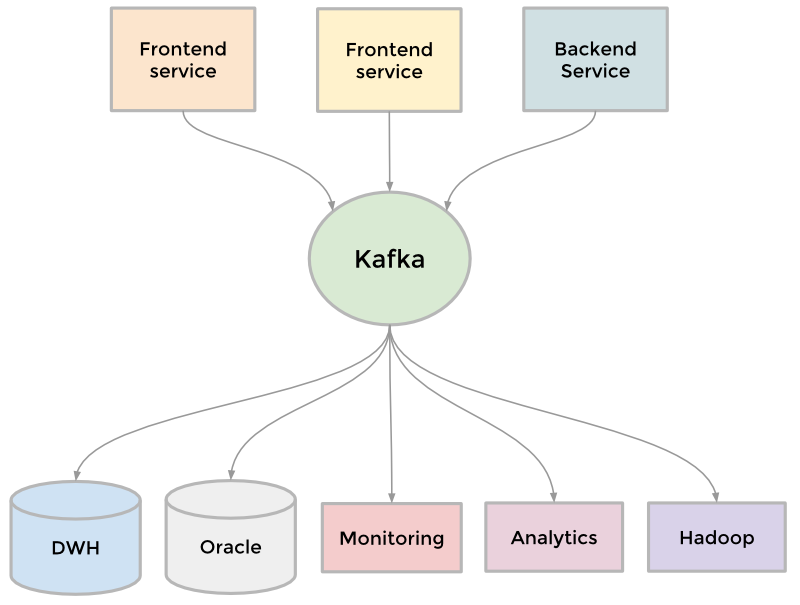
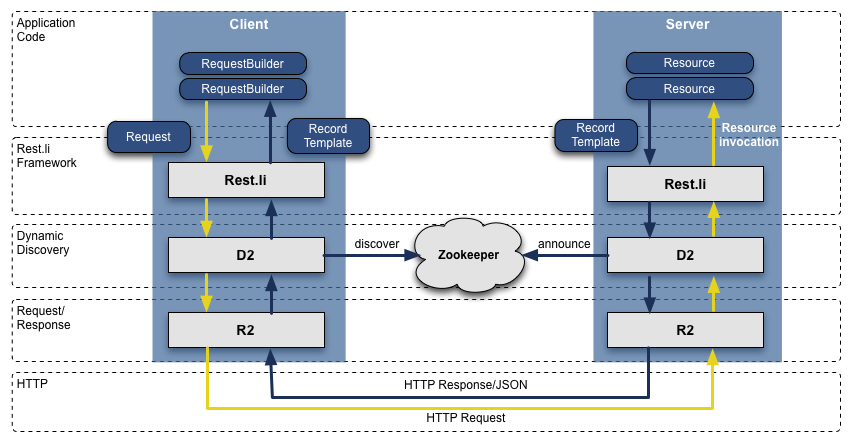

원문: [A Brief History of Scaling LinkedIn](https://engineering.linkedin.com/architecture/brief-history-scaling-linkedin)

# LinkedIn 확장의 간략한 역사

Written by: [Josh Clemm](https://engineering.linkedin.com/blog/authors/j/josh-clemm)   July 20, 2015 

---

LinkedIn은 더 나은 취업 기회를 얻기 위해 네트워크에 확연결하는 것을 목표로 [2003년에 시작](https://ourstory.linkedin.com/)하였습니다. 첫 주에만 2,700 명의 회원이 있었습니다. 수년을 앞두고 LinkedIn의 제품 포트폴리오, 회원 기반 및 서버 로드가 엄청나게 증가했습니다.

현재 LinkedIn은 전 세계적으로 3억 5천만 이상의 회원으로 활동하고 있습니다. 우리는 매일 수 많은 웹 페이지를 제공하고 있습니다. 우리는 모바일 트래픽이 전세계 트래픽의 50% 이상을 차지하는 [mobile moment](http://blog.linkedin.com/2014/04/18/the-next-three-billion/)을 기록 했습니다. 이러한 모든 요청은 백엔드 시스템에서 데이터를 가져 오며, 이는 초당 수백만 개의 쿼리를 처리합니다.

***그래서, 우리는 그것을 어떻게 성취 했을까요?*** 

## 초기 몇 년

### Leo

LinkedIn은 오늘 시작되는 여러 사이트를 하나의 모놀리틱 애플리케이션으로 시작했습니다. 그 단일 애플리케이션은 레오 (Leo)라고 불렀습니다. 모든 다양한 페이지, 비즈니스 로직 처리 및 소수의 LinkedIn 데이터베이스에 연결된 웹 서블릿을 호스팅했습니다.

*Ah, the good old days of website development - nice and simple*

### 회원 그래프 (Member Graph)

소셜 네트워크로 수행해야 할 첫 번째 작업 중 하나는 멤버 간 연결을 관리하는 것입니다. 우리는 그래프 트래버설 (graph traversal)을 사용하여 연결 데이터를 질의하고 최고의 효율성과 성능을 위해 인메모리 시스템을 필요로 했습니다. 이러한 다양한 사용 프로필(use profile)을 통해 Leo와 독립적으로 규모를 조정해야 한다는 것이 분명해 졌기 때문에 LinkedIn의 첫 번째 서비스인 Cloud라는 **멤버 그래프**를 위한 별도의 시스템이 탄생했습니다. 이 그래프 서비스를 Leo와 별도로 유지하기 위해 Java RPC를 사용하여 통신했습니다.

이번에는 검색 기능이 필요했습니다. 우리 회원 그래프 서비스는 [Lucene](https://lucene.apache.org/)을 실행하는 새로운 검색 서비스에 데이터를 제공하기 시작했습니다.

### Replica read DBs

사이트가 성장함에 따라 Leo도 역할과 책임을 증가시키고 자연스럽게 복잡성을 증가 하였습니다. 로드 밸런싱은 Leo의 여러 인스턴스가 돌아가는 것을 도왔습니다. 그러나 LinkedIn의 가장 중요한 시스템인 **회원 프로필 데이터베이스**에 부담이 가중되었습니다.

우리가 한 쉬운 수정은 고전적인 수직 스케일링이었습니다 - 더 많은 CPU와 메모리를 던졌습니다! 저도 시간을 벌어 봤지만 우리는 더 확장 할 필요가 있었습니다. 프로필 데이터베이스는 읽기 및 쓰기 트래픽을 모두 처리하므로 크기를 조정하기 위해 복제본 슬레이브 DB가 도입되었습니다. 복제본 DB는 최초의 [databus](http://data.linkedin.com/blog/2012/10/driving-the-databus) 버전을 사용하여 동기화 된 채로 있는 회원 데이터베이스의 사본이었습니다 (이제 [open- sourced](https://engineering.linkedin.com/data-replication/open-sourcing-databus-linkedins-low-latency-change-data-capture-system) 가 되었습니다). 이들은 모든 읽기 트래픽을 처리하도록 설정 되었으며 논리는 메인 마스터 vs 복제본(replica)에서 읽는 것이 안전한지 (일관된지) 알 수 있도록 작성되었습니다. 

 

*마스터 - 슬레이브 모델은 중기 솔루션으로 작동했지만 이후 우리는 분할된 DB로 바꾸었습니다*

사이트가 점점 더 많은 트래픽을 보게 되면서 우리의 싱글 모놀리틱 애플리케이션인 Leo는 종종 생산성이 감소하기 시작했습니다. 문제를 해결하고 복구하기가 어려웠으며 새로운 코드를 릴리즈하기가 어려웠습니다. LinkedIn에 고가용성은 매우 중요합니다. "레오를 죽여야 한다(Kill Leo)"는 것이 분명해졌고, 그것을 많은 작은 기능과 [stateless services](http://en.wikipedia.org/wiki/Service-oriented_architecture)로 나누었습니다.

*“Kill Leo” was the mantra internally for many years...*

### 서비스 지향 아키텍쳐 (Service Oriented Architecture)

엔지니어링팀은 검색, 프로필, 커뮤니케이션 및 그룹 플랫폼과 같은 API와 비즈니스 논리를 유지하기 위해 마이크로서비스를 추출하기 시작했습니다. 나중에 우리의 리쿠르터 제품 또는 공개 프로필과 같은 영역에 대해 프리젠테이션 계층을 추출했습니다. 신제품의 경우 Leo 이외의 지역에서도 새로운 서비스가 만들어졌습니다. 시간이 흐르면서 각 기능 영역마다 수직 스택이 나타납니다.

우리는 프론트엔드 서버를 구축하여 다른 도메인에서 데이터 모델을 가져오고, 프리젠테이션 로직을 처리하고, JSP를 통해 HTML을 빌드했습니다. 우리는 데이터 모델 및 백엔드 데이터 서비스에 대한 API 액세스를 제공하여 데이터베이스에 대한 일관된 액세스를 제공하는 미드-티어(mid-tier) 서비스를 구축했습니다. 2010년까지 이미 150 개가 넘는 서비스가 있었습니다. 오늘날 우리는 750개 이상의 서비스를 제공하고 있습니다.

 

*LinkedIn 내의 다중 계층 서비스 지향 아키텍처의 예*

Stateless이기 때문에 서비스의 새로운 인스턴스를 잘 굴려서 사용하고, 그 사이의 하드웨어 부하 분산 장치를 사용하여 확장을 달성 할 수 있습니다. 우리는 적극적으로 각 서비스를 재검토하기 시작하여 얼마나 많은 부하가 걸리는지 알았고 초기 프로비저닝 및 성능 모니터링 기능을 구축했습니다.

### Caching

LinkedIn은 급격한 성장에 의해 더 확장 할 필요가 있었습니다. 우리는 더 많은 캐시 레이어를 추가하여 로드를 모두 줄일 수 있다는 것을 알고 있었습니다. 많은 응용 프로그램이 [memcache](https://en.wikipedia.org/wiki/Memcached) 또는 [couchbase](https://en.wikipedia.org/wiki/Couchbase_Server)와 같은 중간 계층 캐싱 계층을 도입하기 시작했습니다. 또한 데이터 레이어에 캐시를 추가하고 필요할 때 미리 계산 된 결과로 [Voldemort](http://engineering.linkedin.com/tags/voldemort)를 사용하기 시작했습니다.

시간이 지남에 따라 실제로 많은 중간 캐시를 제거했습니다. 미드-티어 캐시는 여러 도메인의 파생 데이터를 저장하고있었습니다. 캐시는 처음에는 부하를 줄이는 간단한 방법인 것처럼 보이지만 무효화와 콜 그래프 주변의 복잡성은 손에 닿기 시작했습니다. 가능한 하나의 데이터 저장소에 가장 가까운 캐시를 유지하면 대기 시간이 짧아지고 수평적으로 확장되며 인지하는 부하(cognitive load)가 감소합니다.

### Kafka

점차 늘어나는 데이터를 수집하기 위해 LinkedIn은 스트리밍 및 대기열 데이터를 위한 많은 사용자 지정 데이터 파이프 라인을 개발했습니다. 예를 들어, 데이터웨어 하우스에 데이터가 유입되어야 하고, 분석을 위해 [Hadoop workflow](http://data.linkedin.com/projects/hadoop)에 일괄 데이터를 보내야 하고, 모든 서비스에서 우리는 페이지 뷰와 같은 추적 이벤트를 수집했으며, 인메일 메시지 시스템을 위한 대기열을 필요로했으며 누군가 프로필을 업데이트 할 때마다 인력 검색 시스템을 최신 상태로 유지해야 했습니다.

사이트가 성장함에 따라 더 많은 맞춤 파이프 라인이 등장했습니다. 사이트를 확장해야 하기 때문에 각 파이프 라인을 확장해야 했습니다. 뭔가를 해야 했습니다. 그 결과 우리의 분산된 pub-sub 메시징 플랫폼인 [Kafka](http://blog.confluent.io/2015/02/25/stream-data-platform-1/)가 개발되었습니다. 카프카(Kafka)는 범용 파이프라인이 되어 [커밋 로그](http://engineering.linkedin.com/distributed-systems/log-what-every-software-engineer-should-know-about-real-time-datas-unifying) 개념을 기반으로 구축되었고, 속도와 확장성을 염두에 두고 개발 되었습니다. Hadoop 작업을 지원하는 모든 데이터 소스에 거의 실시간으로 액세스 할 수 있으므로 [실시간 분석](http://engineering.linkedin.com/.com/analytics/real-time-analytics-massive-scale-pinot)을 구축 할 수 있게 하였고, [사이트 모니터링](http://engineering.linkedin.com/samza/real-time-insights-linkedins-performance-using-apache-samza) 및 [알림 기능](http://engineering.linkedin.com/52/autometrics-self-service-metrics-collection)을 매우 향상 시켰으며, [콜 그래프를 시각화하고 추적 할 수 있게](http://engineering.linkedin.com/distributed-service-call-graph/real-time-distributed 웹 사이트 성능 및 효율성)하였습니다. 오늘날, 카프카(Kafka)는 [하루 5천억 개가 넘는 이벤트](http://engineering.linkedin.com/kafka/kafka-linkedin-current-and-future)를 처리합니다.

 

*Kafka as the universal data stream broker*

### Inversion

확장성은 조직을 포함한 여러 차원에서 측정 할 수 있습니다. 2011년 말, LinkedIn은 [Inversion](http://www.bloomberg.com/bw/articles/2013-04-10/inside-operation-inversion-the-code-freeze-that-saved-linkedin)이라는 내부 이니셔티브를 시작했습니다. 이 이니셔티브는 기능 개발을 잠시 중단하고 전체 엔지니어링 조직이 tooling, 배포, 인프라 및 개발자 생산성 향상에 집중할 수 있게 했습니다. 오늘날 우리가 가지고 있는 확장 가능한 신제품을 구축하는 데 필요한 공학적 민첩성을 성공적으로 달성했습니다.

## The modern years 

### Rest.li

Leo에서 서비스 지향 아키텍처로 전환했을때 우리가 가정한 Java기반 RPC를 추출한 API는 팀간에 일관성이 없었으며 프리젠테이션 계층과 밀접하게 결합되어 더 악화되었습니다. 이를 해결하기 위해 [Rest.li](http://engineering.linkedin.com/architecture/restli-restful-service-architecture-scale)이라는 새로운 API 모델을 구축했습니다. Rest.li는 [회사 전반에서]((http://engineering.linkedin.com/restli/linkedins-restli-moment)) 데이터 모델 중심 아키텍처로 전환하여 일관성 있는 Stateless Restful API 모델을 보장했습니다.

새로운 API를 사용하여 JSON over HTTP를 사용함으로써 Java 기반이 아닌 클라이언트를 쉽게 만들 수 있었습니다. LinkedIn은 여전히 Java shop이지만 Python, Ruby, Node.js 및 C ++를 모두 활용하는 고객이 많으며 인수 합병의 기술 스택뿐만 아니라 사내(in house)에서도 개발했습니다. RPC에서 벗어나면 프리젠테이션 계층과의 많은 결합과 많은 하위 호환성 문제가 사라졌습니다. 또한 Rest.li에서 [Dynamic Discovery (D2)](https://github.com/linkedin/rest.li/wiki/Dynamic-Discovery)를 사용하여 자동화 된 클라이언트 기반 로드 밸런싱, 검색 및 각 서비스 API의 확장성을 얻었습니다.

현재 LinkedIn은 975 개의 Rest.li 리소스를 보유하고 있으며 모든 데이터 센터에서 하루 1,000 억 건이 넘는 Rest.li 통화를 처리하고 있습니다.

 

*Rest.li R2/D2 tech stack*

### Super Blocks

서비스 지향 아키텍처는 도메인을 분리하고 독립적으로 서비스를 확장하는 데 적합합니다. 그러나 단점이 있습니다. 많은 애플리케이션에서 다양한 유형의 다양한 데이터를 가져와 수백 가지 다운 스트림 호출을 수행합니다. 이것은 많은 수의 다운 스트림 호출을 모두 고려할 때 일반적으로 "콜 그래프"또는 "팬 아웃"이라고 합니다. 예를 들어 모든 프로필 페이지 요청은 사진, 연결, 그룹, 가입 정보, 팔로우 정보, 긴 형식의 블로그 게시물, 그래프의 연결도, 권장 사항 등을 비롯한 프로필 데이터를 과다하게 가져옵니다.이 콜 그래프는 관리하기 어려울 수 있습니다 점점 더 복잡해지고 있었습니다.

우리는 하나의 액세스 API로 백엔드 서비스를 그룹화 한 수퍼 블록 개념을 도입했습니다. 이를 통해 특정 팀이 각 클라이언트에 대한 호출 그래프를 확인하면서 블록을 최적화하도록 할 수 있습니다.

### Multi-Data Center

급속도로 증가하는 회원을 보유한 글로벌 기업인 우리는 [한 데이터 센터에서](https://www.linkedin.com/pulse/armen-hamstra-how-he-broke-linkedin-got-promoted-angel-au-yeung) 트래픽을 제공하는 것 이상의 범위를 확장해야했습니다. 우리는 수년 전에 이 문제를 해결하기 위해 두 가지 데이터 센터 (로스 앤젤레스와 시카고)에서 공개 프로필을 제공하기 시작했습니다. 검증 된 후, 우리는 모든 서비스가 데이터 복제, 다른 출처의 콜백, 단방향 데이터 복제 이벤트를 처리하고 사용자를 지리적으로 가까운 데이터 센터에 고정시키는 데 착수했습니다.

우리 데이터베이스의 대부분은 [Espresso](http://engineering.linkedin.com/espresso/introducing-espresso-linkedins-hot-new-distributed-document-store) (새로운 사내 멀티 테넌트 데이터 스토어(multi-tenant datastore)에서 실행됩니다. 에스프레소는 멀티 데이터 센터를 염두에 두고 만들어졌습니다. 그것은 마스터/마스터 지원을 제공하고 어려운 복제의 대부분을 처리합니다.

여러 데이터 센터는 "사이트 가동"및 고 가용성을 유지하는 데 매우 중요합니다. 개별 서비스뿐 아니라 전체 사이트에서 단일 지점 오류를 피할 필요가 있습니다. 현재 LinkedIn은 세 가지 주요 데이터 센터에서 실행되며 추가로 [PoP](http://engineering.linkedin.com/performance/how-linkedin-used-pops-and-rum-make-dynamic-content-download-25-faster).

여러 데이터 센터는 "사이트 가동"및 고 가용성을 유지하는 데 매우 중요합니다. 개별 서비스뿐 아니라 전체 사이트에서 단일 지점 오류를 피할 필요가 있습니다. 현재 LinkedIn은 전세계에 [PoP](http://engineering.linkedin.com/performance/how-linkedin-used-pops-and-rum-make-dynamic-content-download-25-faster)이 추가 된 세 가지 주요 데이터 센터를 갖추고 있습니다.

*LinkedIn의 2015년 운영 설정 (원은 데이터 센터, 다이아몬드는 PoP)*

### 우리가 무엇을 했냐면 (What else have we done?)

물론, 우리의 확장성 이야기는 결코 간단하지 않습니다. 다음과 같은 몇 가지 큰 이니셔티브를 비롯하여 모든 엔지니어링 팀과 운영 팀에서 수년 동안 수행해 온 수 많은 작업이 있습니다.

우리의 가장 중요한 시스템 중 상당수는 오랜 세월에 걸쳐 확장을 해결하기 위해 위해 자체 풍부한 역사와 진화를 가지고 있습니다. 여기에는 [회원 그래프 서비스](http://engineering.linkedin.com/real-time-distributed-graph/using-set-cover-algorithm-optimize-query-latency-large-scale-distributed) (Leo 이외의 서비스), [검색]((https://engineering.linkedin.com/search/did-you-mean-galene)) (두 번째 서비스), 뉴스 피드, [통신 플랫폼]((http://www.slideshare.net/manivannan57/LinkedIn-Communication-Architecture-Presentation-2?related=5)) 및 멤버 프로필 백엔드가 포함됩니다.

우리는 장기적인 성장을 가능하게하는 데이터 인프라를 구축했습니다. 이는 Databus 및 Kafka에서 처음으로 입증되었으며 [Samza](https://engineering.linkedin.com/samza/real-time-insights-linkedins-performance-using-apache-samza)는 데이터 스트림, [Espresso](http://engineering.linkedin.com/espresso/introducing-espresso-linkedins-hot-new-distributed-document-store) 및 Voldemort는 스토리지 솔루션, [Pinot](http://engineering.linkedin.com/analytics/real-time-analytics-massive-scale-pinot)은 분석 시스템뿐 아니라 기타 맞춤 솔루션을 제공하고 있습니다. 또한 도구가 개선되어 개발자가 이 인프라를 자동으로 프로비저닝 할 수 있습니다.

우리는 [Hadoop](http://data.linkedin.com/projects/hadoop)과 [Voldemort 데이터 저장소](http://engineering.linkedin.com/tags/voldemort)를 사용하여 대규모 오프라인 워크플로우를 개발했습니다. 당신이 알고 있는 사람들과 같은 데이터 인사이트, 유사한 프로필, 주목 할만한 동창들, 그리고 프로필 브라우즈 맵을 미리 계산합니다.

프론트 엔드 접근 방식을 생각해 보았습니다. [클라이언트 템플릿](http://www.slideshare.net/brikis98/dustjs)을 믹스([프로필 페이지]((http://engineering.linkedin.com/profile/engineering-new-linkedin-profile)), [대학 페이지]((http://engineering.linkedin.com/university/building-linkedin-university-pages)))에 추가했습니다. 인터렉티브 애플리케이션이 더 많아져서 서버에서 JSON 또는 부분 JSON 만 전송해야 하며 템플릿도 CDN 및 브라우저에 캐시됩니다. 또한 [BigPipe](http://engineering.linkedin.com/frontend/new-technologies-new-linkedin-home-page)와 [Play 프레임워크](https://engineering.linkedin.com/play/composable-and-streamable-play-apps)를 사용하여 모델을 스레드 방식의 웹 서버에서 비동기 모델로 변경했습니다.

애플리케이션 코드 외에도 Apache Traffic Server를 사용하여 [여러 계층의 프록시](http://www.slideshare.net/thenickberry/reflectinga-a-year-after-migrating-to-apache-traffic-server)를 도입했습니다. 데이터 센터 고정(pinning), 보안, 인텔리전트 라우팅, 서버 측 렌더링 등을 처리 할 수있는 HAProxy 등이 있습니다.

마지막으로 최적화 된 하드웨어, [advanced memory](http://engineering.linkedin.com/garbage-collection/garbage-collection-optimization-high-throughput-and-low-latency-java-applications) 및 [시스템](http://engineering.linkedin.com/performance/optimizing-linux-memory-management-low-latency-high-throughput-databases) 튜닝 및 최신 Java 런타임 사용으로 서버 성능을 지속적으로 향상시킵니다.

## What’s next

LinkedIn은 계속해서 빠르게 성장하고 있으며 개선하기 위해 할 수있는 일이 아직도 많이 있습니다. 우리는 극미의 문제를 해결하기 위해 노력하고 있습니다. [우리와 함께하십시오!](https://www.linkedin.com/company/linkedin/careers?trk=eng-blog)

 *Thanks to Steve, Swee, Venkat, Eran, Ram, Brandon, Mammad, and Nick for the help in reviewing.*